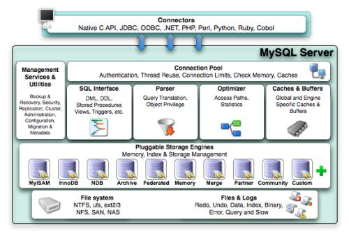

 ## 1.1 定义实例和数据库

+ 数据库：物理操作系统文件或者其他形式文件类型的集合。文件以frm、MYD、MYI、ibd结尾。NDB引擎则是存于内存中的文件。
+ 实例:Mysql数据库由后台线程以及一个共享内存区组成。Mysql数据库实例在系统上的表现就是一个进程。

## 1.2 Mysql体系结构

Mysql有以下几个部分组成：

+ 连接池组件
+ 管理服务和工具组件
+ SQL接口组件
+ 查询分析器组件
+ 优化器组件
+ 缓冲（Cache)组件
+ 插件式存储引擎
+ 物理文件

## 1.3 MYSQL存储引擎

### 1.3.1 InnoDB存储引擎

+ 支持在线事务，设计目标主要面向在想事务处理（OLTP）的应用。其特点是行锁设计、支持外键，并支持类似于Oracle的非锁定读。
+ 使用多版本并发控制（MVCC)来获取高并发性，并实现四种隔离级别。默认为repeatable级别，使用一种被称为next-keylocking的策略避免幻读。
+ 提供插入缓冲、二次写、自适应哈希索引、预读等高并发和高可用功能
+ 对于表中数据的存储，采用聚集（cluster）的方式。表的形式以主键的顺序进行存放

### 1.3.2 MyISAM

+ 不支持事务、表级锁、支持全文检索，主要面向一下OLAP数据库应用
+ 缓冲池只缓存索引文件，而不是缓冲数据文件
+ 表由MYD和MYI组成，MYD用来存放数据文件，MYI用来存放索引文件

### 1.3.3 NDB

​		NDB是集群存储引擎（share nothing架构），类似于Oracle的RAC（share everything架构）集群。数据全部存放于内存。其连接（jion）操作是MySQL数据库层操作。

### 1.3.4 Memory

​		表中数据存于内存中，非常适用存储临时表，以及数据仓库的经纬表。默认使用哈希索引，而不是B+树索引。支持表级锁，并发性差，不支持TEXT和BLOB列类型。存储边长字段（VarChar）按照字段char的方式进行，非常浪费内存。

### 1.3.5 Other存储引擎

+ Archive存储引擎：只支持INSERT和SELECT操作，5.1版本后支持索引，使用zlb算法将数据行（zlib）进行压缩存储，非常适合归档数据存储。
+ Federated存储引擎：不存放数据，只指向远程MySQL数据库上的表。
+ Maria：支持缓存数据和索引文件，应用行级设计，提供MVVC功能，支持事务。MyISAM后续版本。

## 1.4 存储引擎对比

| 功能         | MylSAM | MEMORY | InnoDB | Archive |
| ------------ | ------ | ------ | ------ | ------- |
| 存储限制     | 256TB  | RAM    | 64TB   | None    |
| 支持事务     | No     | No     | Yes    | No      |
| 支持全文索引 | Yes    | No     | No     | No      |
| 支持树索引   | Yes    | Yes    | Yes    | No      |
| 支持哈希索引 | No     | Yes    | No     | No      |
| 支持数据缓存 | No     | N/A    | Yes    | No      |
| 支持外键     | No     | No     | Yes    | No      |

## 1.5 连接mysql

+ TCP/IP套接字
+ 命名管道和共享内存
+ UNIX套接字

