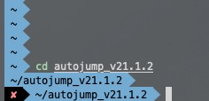
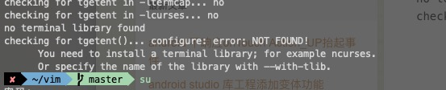

### 阿里云服务器从零配置(centos))


##更换域名
```
hostnamectl set-hostname nopeach
```
## 安装git
```
yum install git -y
```
+ 添加公钥
```
cd .ssh/
ssh-keygen -t rsa -C "***@**.com"
//三次回车
cat cat id_rsa.pub
```
+ 将公钥添加到自己github账户上去

## 创建java用户
```
useradd java
passwd java
```

## 安装zsh
```
yum install zsh -y
```
### 1.安装wd插件（目录映射）
+ 下载wd插件
```
curl -L https://github.com/mfaerevaag/wd/raw/master/install.sh | sh
```
+ 配置
 .zshrc文件中的plugin中添加wd
 执行`source .zshrc`   

+ 使用
```
cd /usr/local
wd add lo
cd
wd lo（进入/usr/local）
```

### 2.配置autojump插件
+ 下载插件、解压、执行
```
wget https://github.com/downloads/wting/autojump/autojump_v21.1.2.tar.gz
tar zxvf autojump_v21.1.2.tar.gz
cd autojump_v21.1.2
./install.sh
cd
vim .zshrc
添加
[[ -s ~/.autojump/etc/profile.d/autojump.zsh ]] && . ~/.autojump/etc/profile.d/autojump.zsh
source .zshrc
```

### 3.添加zsh-syntax-highlighting(语法高亮)
```
git clone https://github.com/zsh-users/zsh-syntax-highlighting.git ${ZSH_CUSTOM:-~/.oh-my-zsh/custom}/plugins/zsh-syntax-highlighting
vim ~/.zshrc
pulgin (
    zsh-syntax-highlighting
)
source .zshrc
```
### 4 配置主题
```
vim ~/.zshrc
ZSH_THEME="agnoster"
source .zshrc
```
效果为：

+ 去掉用户名和域名
```
vim vim .oh-my-zsh/themes/agnoster.zsh-theme
注释掉prompt_conext
## Main prompt
build_prompt() {
  RETVAL=$?
  prompt_status
  prompt_virtualenv
  prompt_aws
#  prompt_conext
  prompt_dir
  prompt_git
  prompt_bzr
  prompt_hg
  prompt_end
}
```
效果为：


zsh基础配置完成

##配置vim

### 1、安装vim
root用户下安装
```
yum install libXt-devel gtk2-devel
yum -y install python-devel ruby ruby-devel perl perl-devel perl-ExtUtils-Embed

./configure --with-features=huge --enable-gui=auto --enable-pythoninterp --with-python-config-dir=/usr/lib64/python2.7/config --with-python3-config-dir= /usr/local/python3/lib/python3.8/config-3.8m-x86_64-linux-gnu --enable-multibyte --with-compiledby="letwhip@gmail.comyum -y install python-devel ruby ruby-devel perl perl-devel perl-ExtUtils-Embed"
```
+ 缺失ncurses



```
yum install libncurses5-dev
```
+ 添加vim插件
```
git clone https://github.com/peach0/vim.git
```
[安装方式](https://github.com/peach0/vim)

## 安装mysql
[mysql安装方式](https://blog.csdn.net/qq_17776287/article/details/53536761)
参照播客一步步安装就行

## 安装PHP
```
yum install libxml2-devel openssl-devel curl curl-devel gd gd-devel libmcrypt libmcrypt-devel

./configure --prefix=/home/java/var/php --with-config-file-path=/home/java/var/php/etc --enable-fpm  --with-fpm-user=java --with-fpm-group=java  --with-mysql-sock=/tmp/mysql.sock  --with-libxml-dir  --with-gd  --with-jpeg-dir --with-png-dir --with-freetype-dir --with-iconv-dir --with-zlib-dir --with-mcrypt --enable-soap --enable-gd-native-ttf --enable-ftp --enable-mbstring --enable-exif --disable-ipv6 --with-pear --with-curl --with-openssl
make
make install
```
缺失各种包，自行查找
[PHP缺失包问题](https://blog.csdn.net/dodott/article/details/49664379)
